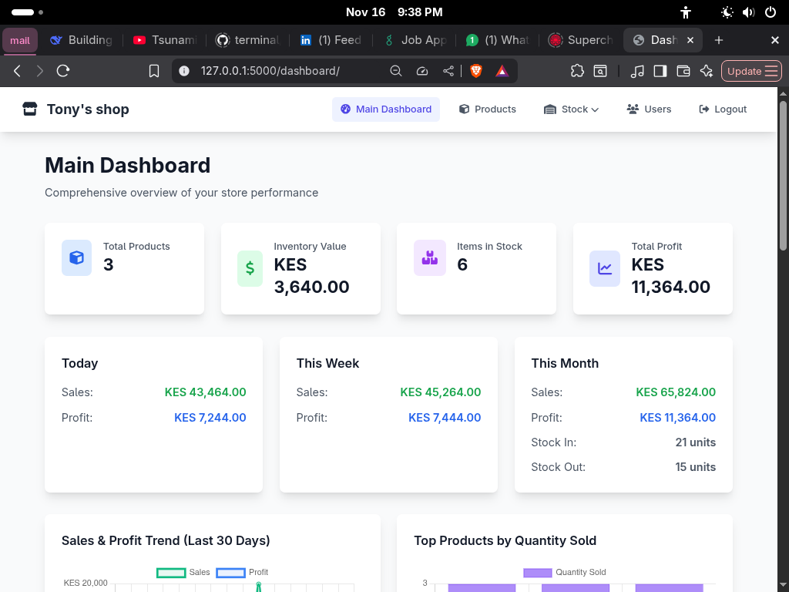
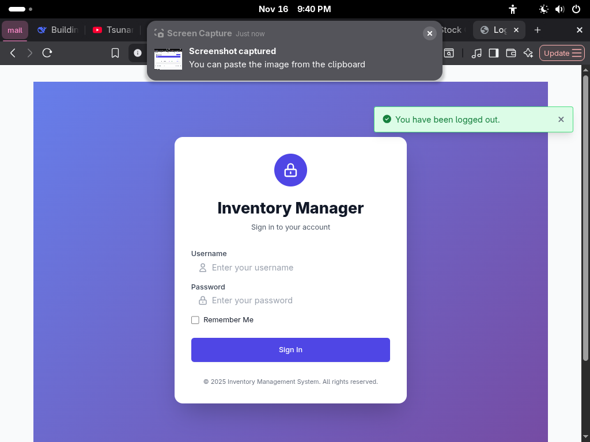
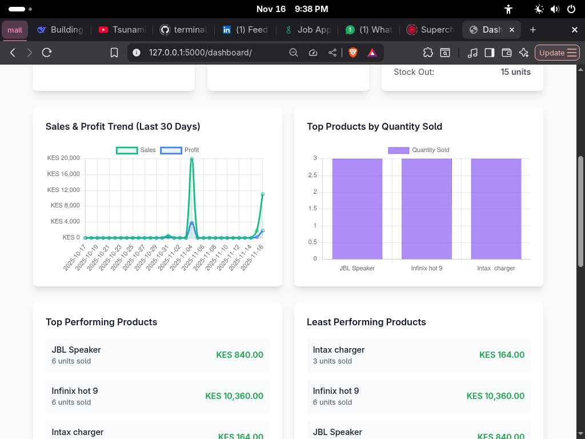
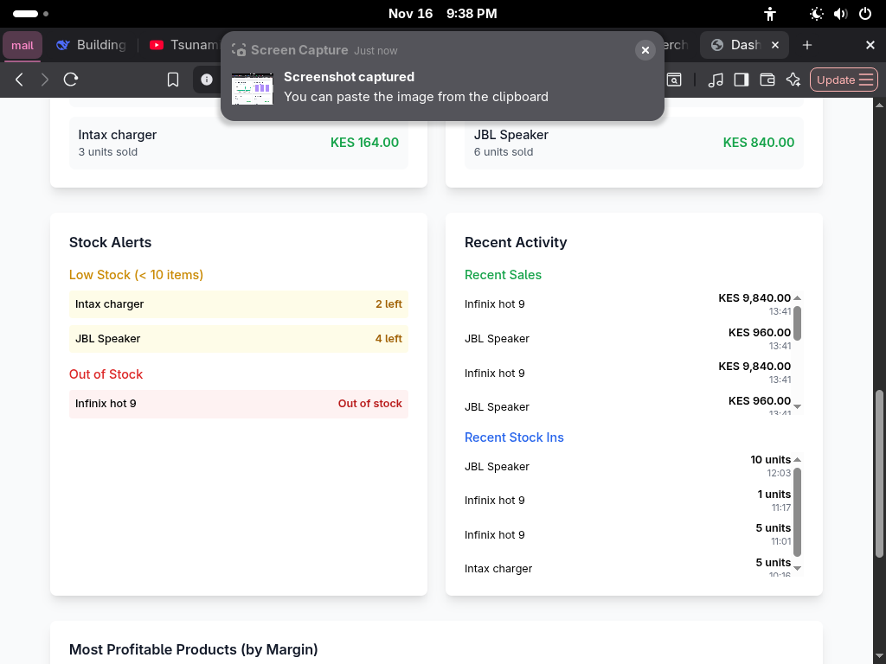
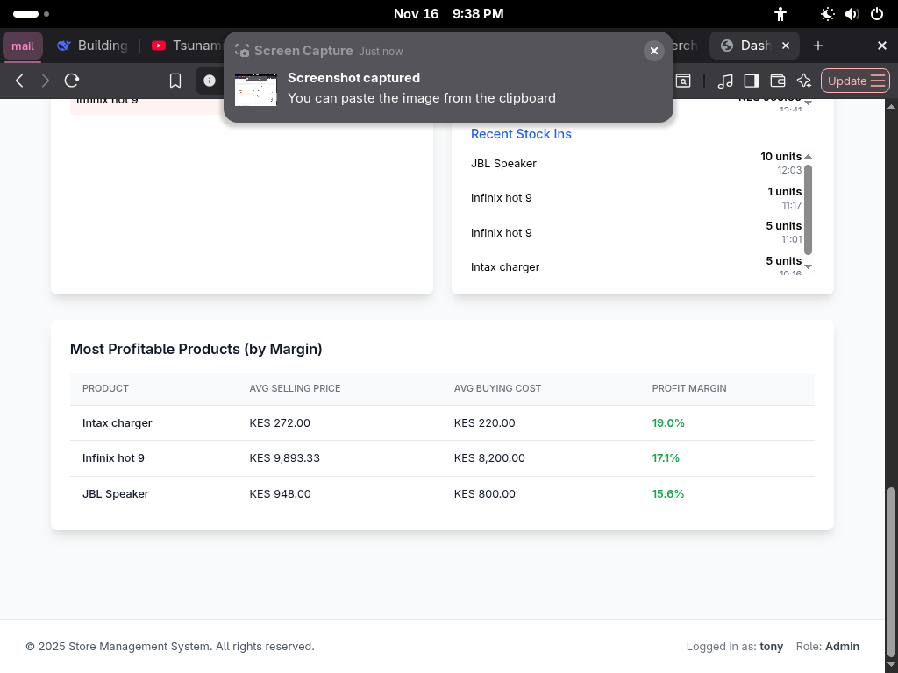
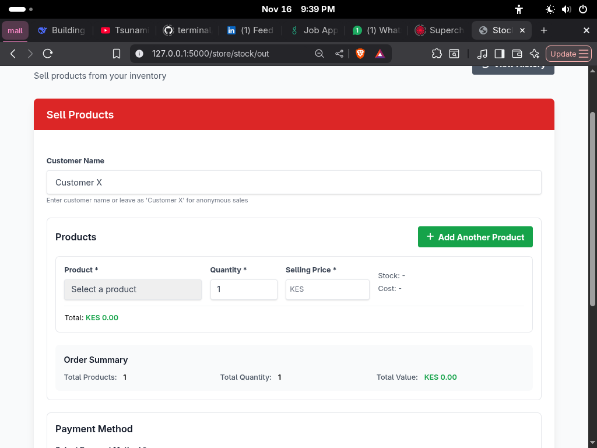
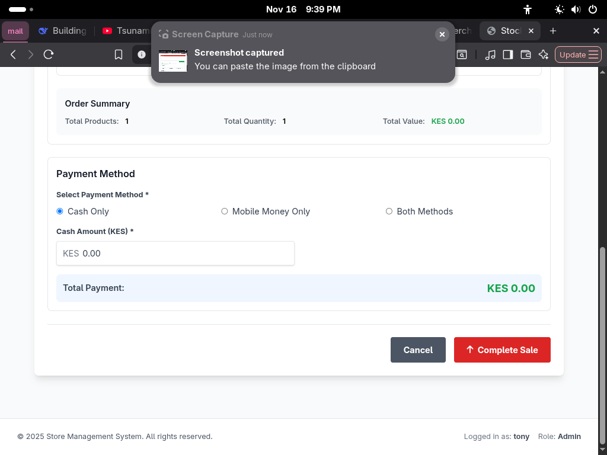
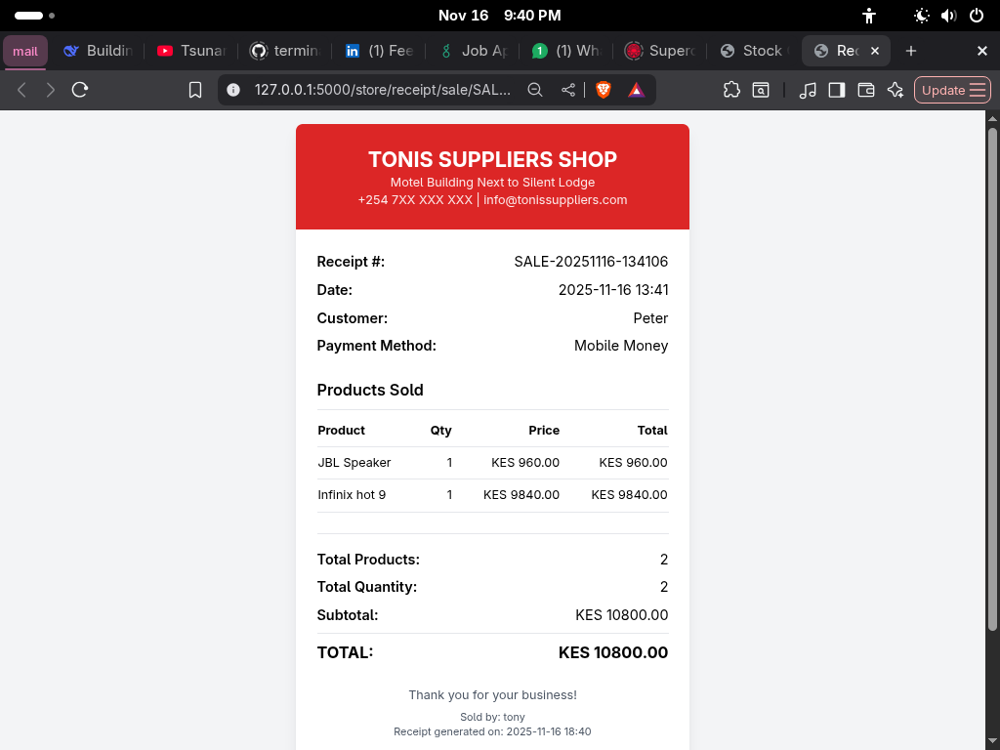
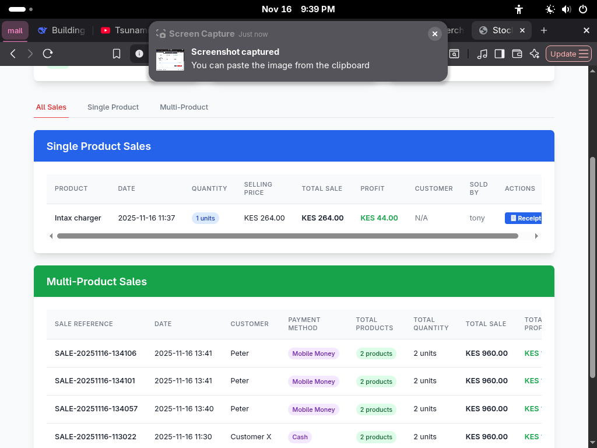

# 🏪 Inventory Management System

A comprehensive, full-stack Inventory Management System built with Flask that helps businesses track stock, manage sales, and generate receipts with real-time analytics.



## 🚀 Features

### 🔐 Authentication & User Management
- **Role-based access control** (Admin & Staff roles)
- Secure login/logout system
- User registration and management
- Session management with Flask-Login



### 📊 Dashboard & Analytics
- **Real-time inventory valuation**
- Stock level monitoring
- Sales performance metrics
- Profit tracking and reporting





### 📦 Stock Management
- **Product catalog management**
- Stock-in tracking with cost calculation
- Automatic inventory updates
- Product information and descriptions


### 🛒 Sales & Point of Sale
- **Multi-product sales system**
- Support for multiple payment methods (Cash, Mobile Money, Both)
- Real-time profit calculation
- Customer information tracking




### 🧾 Receipt Generation
- **Automated receipt creation**
- Professional receipt formatting
- Multi-product sale receipts
- Print-friendly design



### 📈 History & Reporting
- Complete sales history
- Stock movement tracking
- Profit analysis and reporting
- User activity logs





## 🛠️ Technology Stack

### Backend
- **Python Flask** - Web framework
- **SQLAlchemy** - ORM and database management
- **Flask-Login** - Authentication system
- **WTForms** - Form validation and handling
- **Werkzeug** - Password hashing and security

### Frontend
- **HTML5 & Jinja2** - Templating engine
- **Tailwind CSS** - Modern UI styling
- **JavaScript** - Dynamic interactions
- **Responsive Design** - Mobile-friendly interface

### Database
- **SQLite/PostgreSQL** - Data persistence
- **Database Relationships** - Complex data modeling

## 📋 Prerequisites

Before running this project, make sure you have the following installed:

- Python 3.8 or higher
- pip (Python package manager)
- Virtualenv (recommended)

## 🚀 Installation & Setup

### 1. Clone the Repository
```bash
git clone https://github.com/Pe-ter-M/Tony-s-project
cd inventory-management-system
```

### 2. Create Virtual Environment
```bash
python -m venv venv
source venv/bin/activate #This works on windows, other os user use the correct command
```

### 3. Install Dependencies
```bash
pip install -r requirements.txt
```

### 4. Environment Configuration
Create a `.env` file in the root directory:
```env
SECRET_KEY=your-secret-key-here
DATABASE_URL=sqlite:///inventory.db
FLASK_ENV=development
```

### 5. Database Setup
```bash
flask db upgrade
# or
python -c "from app import db; db.create_all()"
```

### 6. Run the Application
```bash
flask run
# or
python run.py
```

The application will be available at `http://localhost:5000`

## 👥 Default Users

After setup, create your first admin user:

1. Register a new user through the registration page
2. The first user will have admin privileges
3. Admins can create additional staff users

## 🏗️ Project Structure

```
inventory-management-system/
├── app/
│   ├── __init__.py
│   ├── models/
│   │   ├── user.py
│   │   └── product.py
│   ├── routes/
│   │   ├── auth.py
│   │   └── store.py
│   ├── templates/
│   │   ├── base.html
│   │   ├── auth/
│   │   └── store/
│   └── static/
│       ├── css/
│       └── js/
├── migrations/
├── requirements.txt
├── config.py
└── run.py
```

## 🔧 Configuration

### Database Models
- **User** - Authentication and user management
- **Product** - Product catalog and information
- **StockIn** - Stock incoming records
- **StockOut** - Sales and stock outgoing records
- **Inventory** - Current stock levels and valuation

### Key Features Implementation

#### Multi-Product Sales
```python
# Advanced sales system supporting multiple products in one transaction
sale_reference = f"SALE-{datetime.utcnow().strftime('%Y%m%d-%H%M%S')}"
# Each product in the sale is linked with the same sale_reference
```

#### Payment Methods
- **Cash** - Traditional cash payments
- **Mobile Money** - Digital payments
- **Both** - Split payments between cash and mobile money

#### Profit Calculation
```python
# Automatic profit calculation
profit = (selling_price - buying_cost) * quantity_sold
```

## 🎯 Usage Examples

### Adding New Products
1. Navigate to Products page
2. Click "Add New Product"
3. Fill in product details
4. Save to automatically create inventory record

### Processing Sales
1. Go to Stock Out page
2. Add products to the sale
3. Set quantities and prices
4. Select payment method
5. Complete the sale

### Generating Reports
1. View Stock Out History for sales reports
2. Check Dashboard for inventory valuation
3. Use receipt generation for transaction records

## 🤝 Contributing

We welcome contributions! Please feel free to submit pull requests or open issues for bugs and feature requests.

### Development Setup
1. Fork the repository
2. Create a feature branch
3. Make your changes
4. Add tests if applicable
5. Submit a pull request

## 📄 License

This project is licensed under the MIT License - see the [LICENSE](LICENSE) file for details.

## 🐛 Troubleshooting

### Common Issues

**Database errors:**
```bash
flask db migrate
flask db upgrade
```

**Import errors:**
- Ensure virtual environment is activated
- Check all dependencies are installed

**Login issues:**
- Verify user is active in database
- Check password hashing

## 📞 Support

If you encounter any problems or have questions:

1. Check the [Issues](https://github.com/yourusername/inventory-management-system/issues) page
2. Create a new issue with detailed description
3. Provide steps to reproduce the problem

## 🙏 Acknowledgments

- Flask community for excellent documentation
- Tailwind CSS for the utility-first CSS framework
- Contributors and testers

---

**⭐ Star this repo if you find it helpful!**

*Built with ❤️ using Python Flask*

---